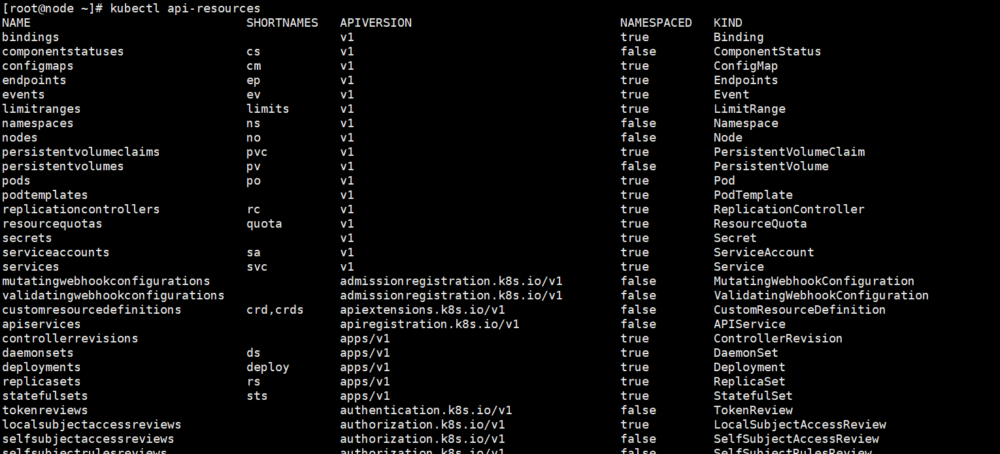

# `kubectl api-resources`

使用此命令，可以查看当前集群支持的资源及其版本号。



- NAME 资源名称
- SHORTNAMES 资源缩写
- APIVERSION API版本
- NAMESPACED 是否区分命名空间
- KIND 资源类型

其中APIVERSION部分，以`/`分隔，前面的为API Group，后面的为API版本号。例如：

```bash
#Pod，api组为空，即为**核心组**，api版本为v1。
pods  po  v1

#守护进程，api组为apps，api版本为v1。
daemonsets  ds  apps/v1 

#动态准入控制的mutating webhook配置，api组为admissionregistration.k8s.io，api版本为v1。
mutatingwebhookconfigurations  admissionregistration.k8s.io/v1
```

# 工作负载资源

## Pod [pods/po] 核心组/v1

**Pod 是可以在 Kubernetes 中创建和管理的、最小的可部署的计算单元。**

一个Pod中可以包含多个容器，这些容器共享存储、网络、以及怎样运行这些容器的规约。 

Pod 中的内容总是并置（colocated）的并且一同调度，在共享的上下文中运行。

*一个Pod中只包含一个容器 (Container) 是 K8s 的最佳实践。*

## 工作负载管理

### Deployments [deployments/deploy] apps/v1

Deployment 用于管理运行一个应用负载的一组 Pod，通常适用于无状态的负载。

一个 Deployment 为 Pod 和 ReplicaSet 提供声明式的更新能力。

### ReplicaSet [replicasets/rs] apps/v1

ReplicaSet 的作用是维持在任何给定时间运行的一组稳定的副本 Pod。 

*通常会定义一个 Deployment，并用这个 Deployment 自动管理 ReplicaSet。*

### StatefulSet [statefulsets/sts] apps/v1

StatefulSet 运行一组 Pod，并为每个 Pod 保留一个稳定的标识。 这可用于管理需要持久化存储或稳定、唯一网络标识的应用。(有状态负载)

### DaemonSet [daemonsets/ds] apps/v1

DaemonSet 定义了提供节点本地设施的 Pod。这些设施可能对于集群的运行至关重要，例如网络辅助工具，或者作为 add-on 的一部分。

DaemonSet 的一些典型用法：

- 在每个节点上运行集群守护进程
- 在每个节点上运行日志收集守护进程
- 在每个节点上运行监控守护进程

### Job [jobs] batch/v1

### CronJob [cornjobs] batch/v1


