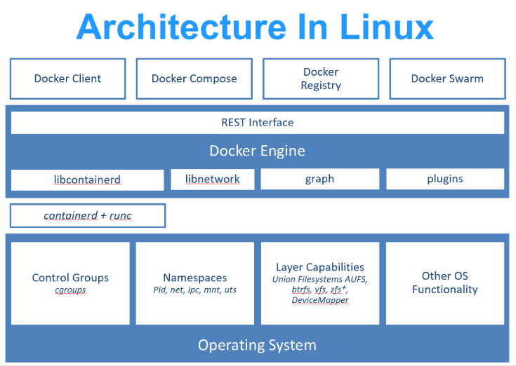
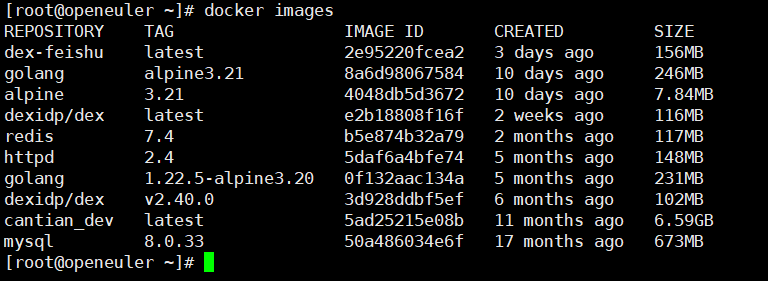

# Docker

Docker是个划时代的开源项目。它彻底释放了计算虚拟化的威力，极大提高了应用的维护效率，降低了云计算应用的开发成本。

使用Docker可以极大地方便应用的开发、部署和测试。

## 什么是Docker

- Docker使用Google公司推出的Go语言进行开发实现;

- 基于Linux内核的`cgroup`，`namespace`，以AUFS等技术对进程进行封装和隔离，属于操作系统级别的虚拟化技术;

- 隔离的进程独立于宿主和其他进程，因此叫做*容器*（Container）

- 容器的实现最初基于`LXC`，到自研的`libcontainer`，再到之后的`runC`和`containerd`。

## 传统虚拟化与docker

传统虚拟机技术是虚拟出一套硬件后，在其上运行一个完整操作系统，在该系统上再运行所需应用进程。

而容器内的应用进程直接运行于宿主的内核，容器内没有自己的内核，而且也没有进行硬件虚拟。

因此容器要比传统虚拟机更为轻便。

## Docker的优势

- 更高效地利用系统资源

- 更快速的启动时间

    Docker应用直接运行于宿主机内核，无需启动完整的操作系统

- 一致的运行环境

- 对于DevOps人员，更轻松地CI/CD和Deploy

- 轻松迁移

- 轻松维护和扩展

### 对比传统虚机

|特性|容器|虚拟机|
|---|---|---|
|启动|秒级|分钟级|
|硬盘使用|一般是MB|一般是GB|
|性能|接近原生|明显弱于原生|
|系统支持量|单个机器支持上千个容器|一般几十个|

 

## 基本概念

### 镜像 image

操作系统分为：内核 用户空间

对于Linux系统，内核启动后会挂载`root`文件系统为用户提供空间支持

Docker镜像（Docker image）就相当于一个root文件系统。

它除了提供CRI（容器运行时）所需的程序、库、资源外，还包含了为运行时准备的配置参数（匿名卷、环境变量、用户等）

**镜像不包含任何动态数据。** 内容在构建后也不会改变。

Docker镜像是一个虚拟的概念，实际表现由多层文件系统联合组成。

由`Dockerfile`构建镜像时，会一层一层构建，前一层是后一层的基础，每一层构建完都不会再改变，下一层的改变只发生在自己这一层。

    删除前一层的文件并不是真的删除，而是在本层标记为已删除。

    最终容器运行的时候，虽然看不到这个文件，实际上这个文件一直跟着容器。

利用这一特性，可以使用已经构建好的镜像进行定制，然后构建新的镜像。

 

### 容器 Container

容器是镜像运行时的实体，可以被`创建`、`启动`、`暂停`、`重启`、`停止`、`删除`等。

容器的实质是进程，但与直接在宿主上运行进程不同，容器进程运行于属于自己独立的namespace，使用起来像是独立于宿主的操作系统。

**容器也是分层存储。**

每一个容器运行时，以镜像层为基础，再其上创建一个当前容器的存储层（容器存储层），生命周期跟随容器。

按照 Docker 最佳实践的要求，容器*不应该向其存储层内写入任何数据，容器存储层要保持无状态化。*

所有的文件写入操作，都应该使用 `数据卷（Volume）`、或者 `绑定宿主目录`，在这些位置的读写会跳过容器存储层，直接对宿主（或网络存储）发生读写，其性能和稳定性更高。

数据卷的生存周期独立于容器，容器消亡，数据卷不会消亡。因此，使用数据卷后，容器删除或者重新运行之后，数据却不会丢失。

 

### Docker Registry

*用于存储、分发镜像的服务。（如Docker Hub, Harbor, Nexus）*

每一个Docker Registry包含多个`仓库(Repository)`；每个仓库可以包含多个`标签(Tag)`，每个标签对应一个镜像。

通常，一个仓库会包含同一个软件不同版本的镜像，而标签就常用于对应该软件的各个版本。我们可以通过 `<仓库名>:<标签>` 的格式来指定具体是这个软件哪个版本的镜像。如果不给出标签，将以 `latest` 作为默认标签。

 
