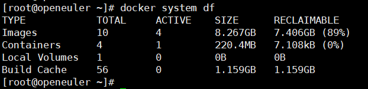
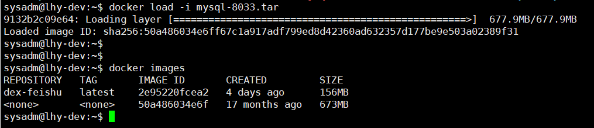
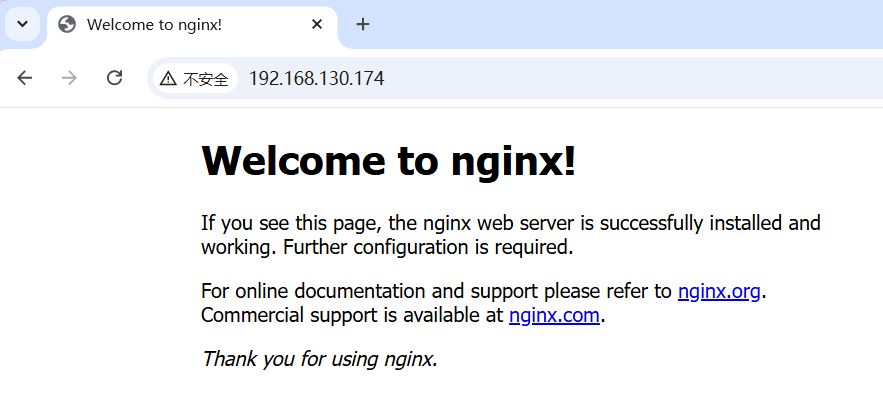
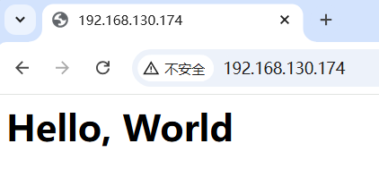

# 使用镜像

## 获取镜像

```bash
docker pull [选项] [Docker Registry 地址[:端口号]/]仓库名[:标签]
```

Docker Registry默认地址：`docker.io` (Docker Hub)

比如：

```bash
docker pull redis:7.2.0
```

## 运行镜像

基础命令结构：

```bash
docker run [选项及其参数] 镜像名/镜像id [命令] [参数]
```

比如：
```bash
docker run -it --rm ubuntu:18.04 bash
```

如果镜像在本地没有，则docker会尝试pull这个镜像。

## 列出镜像

```bash
docker images
# 或
docker image ls 
```


### 查看镜像体积

在DockerHub中显示的镜像大小是需要通过网络传输的大小

而`docker images`显示的大小是镜像本地load之后的大小

使用如下命令可以查看容器、镜像、数据卷所占用的空间：
```bash
docker system df
```



### 虚悬镜像

有的镜像既没有仓库名，也没有标签，显示都为`<none>`

这种镜像的产生原因有（不全）：

- 新旧镜像同名，旧镜像的名称被取消

- `docker save` 的时候使用镜像id而非镜像名，重新load的时候就会变成`<none>`



这类无标签镜像也被称为 *虚悬镜像(dangling image)* ，可以用下面的命令专门显示这类镜像

```bash
docker image ls -f dangling=true
```

删除本地所有的悬虚镜像：
```bash
docker image prune
```

## 删除本地镜像

```bash 
docker image rm [options]  [..]
# 或
docker rmi 
```

也可以与`docker images`配合使用。

```bash
docker image rm $(docker image ls redis)
docker rmi $(docker images -q -f before=golang:1.22.5)
```

## docker commit

这个命令可以定制镜像，**但正规的定制镜像应该使用`Dockerfile`。**

利用Docker Hub官方的镜像可以完成一些事，但是经常会遇到需要定制自定义功能的情况

假设我们启动了一个官方的nginx

```bash
[root@openeuler imgs]# docker run -d --name webserver -p 80:80 nginx:1.23.2
bef0511b3fcd567079dd94a1cc1d4a66e36b11cc7613a3ac996ec1db25848547
```

正常情况下输入`http://localhost`或`http://虚机ip`能看到nginx默认的欢迎页面



假设现在需要修改这个页面，可以使用`docker exec`进入容器修改内容。

```bash
[root@openeuler imgs]# docker exec -it webserver bash
root@bef0511b3fcd:/# echo '<h1>Hello, World</h1>' > /usr/share/nginx/html/index.html 
root@bef0511b3fcd:/# exit
exit
[root@openeuler imgs]# 
```

修改完成后，刷新页面



刚刚的操作修改了容器的存储层。可以利用`docker diff`看到具体改动:

```bash
[root@openeuler imgs]# docker diff webserver 
C /etc
C /etc/nginx
C /etc/nginx/conf.d
C /etc/nginx/conf.d/default.conf
C /root
A /root/.bash_history
C /run
A /run/nginx.pid
C /usr
C /usr/share
C /usr/share/nginx
C /usr/share/nginx/html
C /usr/share/nginx/html/index.html
C /var
C /var/cache
C /var/cache/nginx
A /var/cache/nginx/client_temp
A /var/cache/nginx/fastcgi_temp
A /var/cache/nginx/proxy_temp
A /var/cache/nginx/scgi_temp
A /var/cache/nginx/uwsgi_temp
[root@openeuler imgs]# 
```

现在已经定制好了变化，需要保存成镜像。

`docker commit`命令可以将容器的存储层保存下来，叠加在原有的镜像上形成新的镜像。

```bash
docker commit [options] <容器id/名> [<仓库名>[:<标签>]]

[root@openeuler imgs]# docker commit webserver nginx:v2
sha256:16577f8cb1a76f20be85369c5531f17c3c1a01772a02bca716ff6f6e76e4d36e
[root@openeuler imgs]# docker images
REPOSITORY    TAG                 IMAGE ID       CREATED         SIZE
nginx         v2                  16577f8cb1a7   5 seconds ago   142MB
nginx         1.23.2              ac8efec875ce   2 years ago     142MB
```

用同样的方法运行镜像，会看到与修改后的`webserver`一样的页面。

不过，上述行为对于镜像的操作都是黑箱操作，生成的镜像也叫*黑箱镜像*。且如果仅用`docker commit`修改，每修改一次就添加一层，会使得镜像越来越臃肿。

因此需要定制镜像还需使用`Dockerfile`。
