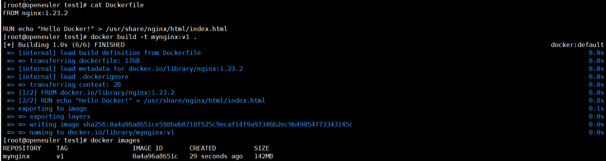
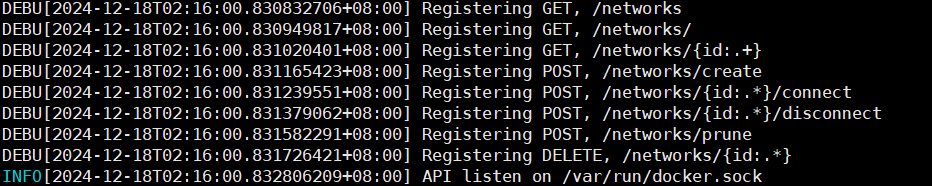
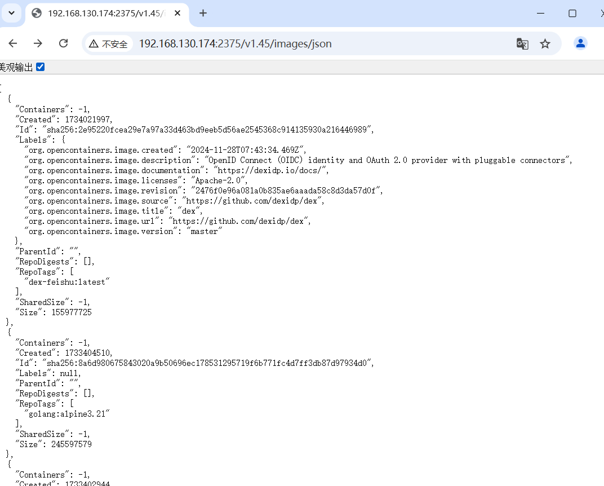
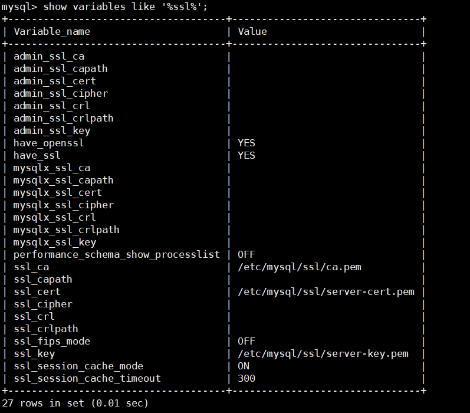
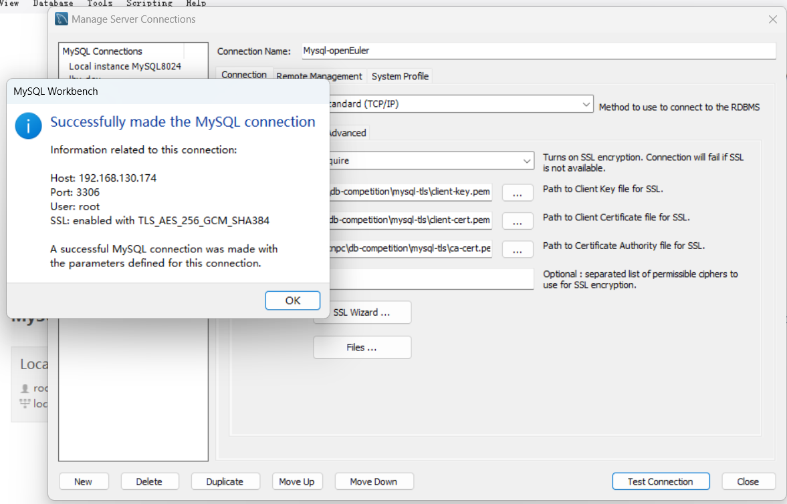

# 使用Dockerfile定制镜像

定制镜像的本质：*定制每一层所添加的配置、文件。*

可以把每一层的修改、安装、构建等操作都写入一个脚本，用这个脚本来构建镜像。这个脚本就是`Dockerfile`。

使用`Dockerfile`，可以解决镜像构建无法重复的问题、镜像构建透明性的问题、体积的问题。

## Dockerfile

是一个文本文件，其中包含了一条一条的**指令**，每一条指令构建一层。

比如Nginx自定义的Dockerfile：

在空白目录中创建`Dockerfile`文件

```bash
mkdir mynginx
cd mynginx
touch Dockerfile
```

编辑Dockerfile

```Dockerfile
FROM nginx:1.23.2

RUN echo '<h1>Hello, Docker!</h1>' > /usr/share/nginx/html/index.html
```
****

### `FROM` 指定基础镜像

定制镜像时，基础镜像必须指定。因此在`Dockerfile`中，`FROM`是必备的，且必须是第一条指令。

除了类似`nginx`、`redis`等可以直接拿来用的服务镜像，Docker Hub还提供了一些更为基础的操作系统镜像，如`ubuntu`、`debian`、`centos`、`alpine`；也有方便于开发的语言镜像，如`node`、`openjdk`、`python`、`golang`等。

此外，还可以选择不使用任何基础镜像，即使用空镜像`scratch`。

```Dockerfile
FROM scratch
...
```

如果以 scratch 为基础镜像的话，意味着不以任何镜像为基础，接下来所写的指令将作为镜像第一层开始存在。

对于 Linux 下静态编译的程序来说，并不需要有操作系统提供运行时支持，*所需的一切库都已经在可执行文件里了*，因此直接 `FROM scratch` 会让镜像体积更加小巧。使用 Golang 开发的应用很多会使用这种方式来制作镜像。

******

### `RUN` 执行命令行命令

就跟直接在命令行中输入命令一样。

shell、exec格式：

```Dockerfile
RUN <命令>

RUN ["可执行文件", "参数1", "参数2"]
```

虽然一次RUN是执行了一次命令行命令，但是每一次RUN都会让镜像多加一层，有时这并没有任何意义。如：

```Dockerfile
FROM debian:stretch

RUN apt-get update
RUN apt-get install -y gcc libc6-dev make wget
RUN wget -O redis.tar.gz "http://download.redis.io/releases/redis-5.0.3.tar.gz"
RUN mkdir -p /usr/src/redis
RUN tar -xzf redis.tar.gz -C /usr/src/redis --strip-components=1
RUN make -C /usr/src/redis
RUN make -C /usr/src/redis install
```

这所有的步骤都是同一个目的：安装redis可执行文件。因此没有必要用这么多次RUN，**这不是在写shell脚本**。

```Dockerfile
FROM debian:stretch

RUN set -x; buildDeps='gcc libc6-dev make wget' \
    && apt-get update \
    && apt-get install -y $buildDeps \
    && wget -O redis.tar.gz "http://download.redis.io/releases/redis-5.0.3.tar.gz" \
    && mkdir -p /usr/src/redis \
    && tar -xzf redis.tar.gz -C /usr/src/redis --strip-components=1 \
    && make -C /usr/src/redis \
    && make -C /usr/src/redis install \
    && rm -rf /var/lib/apt/lists/* \
    && rm redis.tar.gz \
    && rm -r /usr/src/redis \
    && apt-get purge -y --auto-remove $buildDeps
```

在正确的写法中，将原本7层镜像简化成了1层，还可以看到这一组命令的最后添加了清理工作的命令，删除了为了编译构建所需要的软件，清理了所有下载、展开的文件，并且还清理了 apt 缓存文件。

镜像是多层存储，每一层的东西并不会在下一层被删除，会一直跟随着镜像。因此镜像构建时，一定要确保每一层只添加真正需要添加的东西，任何无关的东西都应该清理掉。

******

### `build`镜像

```bash
docker build -t <自定义镜像名:标签> <上下文路径/URL/->

docker build -t mynginx:v1 .
```

可以清晰地看到构建过程。



构建成功后，按照一样的方式运行这个镜像，运行结果和在容器中修改的那一版一样。

*****

### 构建镜像上下文 `Context`

Docker运行时(Docker Runtime)分为：

- Docker引擎(Docker Engine，服务端守护进程docker daemon)
- 客户端工具(Docker Cli)

Docker引擎提供了一组`RESTful API`，称为`Docker Remote API`。docker cli通过 **Unix套接字(/var/run/docker.sock)** 和这组API 与docker守护进程通信。

在*docker服务停止*时使用`dockerd --debug`



可以看到docker的RESTful API。docker守护进程进入debug模式。这时候输入`docker ps -a`和 `docker images`，可以在日志界面看到调用的API：

```bash
DEBU[2024-12-18T02:21:49.053673367+08:00] Calling HEAD /_ping                           spanID=083e710e9d6ad9a5 traceID=3ee5d3851d24e370d9554ed775e2828a
DEBU[2024-12-18T02:21:49.057752341+08:00] Calling GET /v1.45/containers/json?all=1      spanID=45538c67203cc9ed traceID=41be8011572097abe950ef2b7c17b6b0
DEBU[2024-12-18T02:22:28.696664386+08:00] Calling HEAD /_ping                           spanID=40a200801a1373d8 traceID=a5ab3b1a0a6e5e139e37f988ddd4d422
DEBU[2024-12-18T02:22:28.698387923+08:00] Calling GET /v1.45/images/json                spanID=a5049a2724c4f19e traceID=06253134d98838907bdf644cfe32c262
```

表面上看起来所有操作都在本地，实际上都是以远程调用的形式在服务器端(Docker Engine)完成各种操作。因此docker是`C/S`设计。

远程访问docker API：




在构建镜像时，除了`RUN`，还会有将本地文件添加进镜像的操作。如`ADD`、`COPY`。

因此`docker build`构建镜像，并非在本地构建，而是**在docker engine的服务端进行构建**。

构建时，用户指定构建镜像上下文的路径，`docker build` 命令得知这个路径后，会将路径下的所有内容打包，然后上传给 Docker 引擎。

Docker 引擎收到这个上下文包后，展开就会获得构建镜像所需的一切文件。

如果Dockerfile里这么写：
```Dockerfile
COPY ./abc.txt /app/
```

这并不是将当前目录下的abc.txt文件拷贝进容器，而是将上下文路径下的这个文件拷贝进容器。

因此，COPY 这类指令中的源文件路径都是*相对路径*。

比如：
```Bash
docker build -t abc:v1 . # 以当前目录作为上下文目录

docker build -t abc:v2 / 
# 以根目录作为上下文目录，相当于打包整个硬盘
```

一般来说，应该会将 Dockerfile 置于一个空目录下，或者项目根目录下。如果该目录下没有所需文件，那么应该把所需文件复制一份过来。

如果目录下有些东西确实不希望构建时传给 Docker 引擎，那么可以用 `.gitignore` 一样的语法写一个 `.dockerignore`，该文件是用于剔除不需要作为上下文传递给 `Docker` 引擎的。

在默认情况下，如果不额外指定 Dockerfile ，会将上下文目录下的名为 Dockerfile 的文件作为 Dockerfile。也可使用`-f`参数指定Dockerfile。

*****

### `COPY` 复制文件

COPY 指令将从构建上下文目录中 `<源路径>` 的文件/目录复制到新的一层的镜像内的 `<目标路径>` 位置。

```Dockerfile
COPY [--chown=<user>:<group>] <源路径>... <目标路径>
```

源路径可以有多个，也可以用通配符。

```Dockerfile
COPY hom* /app/
COPY hom?.txt /app/
```

目标路径可以是容器内的绝对路径，也可以是相对于工作目录的相对路径(Workdir)，目标路径若不存在会自动创建。

此外，使用`COPY`指令，**源文件的各种元数据都将保留**，如读写权限等。使用此指令时，也可以带上`--chown=<user>:<group>`参数设置文件所属。

如果源路径为文件夹，复制的时候不是直接复制该文件夹，而是将文件夹中的内容复制到目标路径。

****

### `ADD` 也是复制文件，功能更多

**在Docker最佳实践文档中要求，尽可能的使用`COPY`**，因为`COPY`语义明确，只是复制文件，而`ADD`包含了更为复杂的功能，其行为也不一定很清晰。

最适合使用`ADD`的情况，就是**需要自动解压缩的时候**。

如果 `<源路径>` 为一个 `tar` 压缩文件的话，压缩格式为 `gzip`, `bzip2` 以及 `xz` 的情况下，`ADD` 指令将会自动解压缩这个压缩文件到 `<目标路径>` 去。

```Dockerfile
FROM scratch
ADD ubuntu-xenial-core-cloudimg-amd64-root.tar.gz \
...
```

如果用`COPY`传进去需要解压缩，还得再加一层`RUN`解压缩，这时候直接使用`ADD`就会少一层。

但如果不需解压，须直接用`COPY`。

****

### `ENV` 设置环境变量

格式有两种：

```Dockerfile
ENV <key> <value>
ENV <key1>=<value1> <key2>=<value2>
```

这个命令的用处很简单，就只是配置环境变量。无论后面的其他指令还是启动的应用，都可以直接使用这里的环境变量。

定义了环境变量，那么在后续的指令中，就可以使用这个环境变量。比如在官方 `node` 镜像 Dockerfile 中，就有类似这样的代码：

```Dockerfile
ENV NODE_VERSION 7.2.0

RUN curl -SLO "https://nodejs.org/dist/v$NODE_VERSION/node-v$NODE_VERSION-linux-x64.tar.xz" \
  && curl -SLO "https://nodejs.org/dist/v$NODE_VERSION/SHASUMS256.txt.asc" \
  && gpg --batch --decrypt --output SHASUMS256.txt SHASUMS256.txt.asc \
  && grep " node-v$NODE_VERSION-linux-x64.tar.xz\$" SHASUMS256.txt | sha256sum -c - \
  && tar -xJf "node-v$NODE_VERSION-linux-x64.tar.xz" -C /usr/local --strip-components=1 \
  && rm "node-v$NODE_VERSION-linux-x64.tar.xz" SHASUMS256.txt.asc SHASUMS256.txt \
  && ln -s /usr/local/bin/node /usr/local/bin/nodejs
```

可以支持环境变量展开的指令： `ADD`、`COPY`、`ENV`、`EXPOSE`、`FROM`、`LABEL`、`USER`、`WORKDIR`、`VOLUME`、`STOPSIGNAL`、`ONBUILD`、`RUN`

使用环境变量，可以使Dockerfile的可重用性大大增加。

*****

### 利用上述命令和mysql官方镜像，自定义带有tls的mysql镜像

测试环境：`OpenEuler 22.04 LTS` `Docker Engine: 26.1.3`

1. 首先在docker hub上拉取官方的mysql镜像：

```bash
docker pull mysql:8.0.40
```

2. 查看虚机有没有openssl环境，没有则安装：

```bash
openssl version
yum install -y openssl
```

3. 按照下面步骤生成tls证书

**mysql只支持pem格式的证书。**

```bash
mkdir mysql-tls && cd mysql-tls

# 生成CA私钥
openssl genpkey -algorithm RSA -out ca-key.pem -aes256

# 利用私钥生成CA证书
openssl req -new -x509 -key ca-key.pem -out ca.pem -days 3650

# 生成服务器端私钥
openssl genpkey -algorithm RSA -out server-key.pem

# 生成服务器端证书请求
openssl req -new -key server-key.pem -out server-req.pem

# 生成服务器端证书
openssl x509 -req -in server-req.pem -CA ca-cert.pem -CAkey ca-key.pem -CAcreateserial -out server-cert.pem -days 3650

# 生成客户端私钥
openssl genpkey -algorithm RSA -out client-key.pem

# 生成客户端证书请求
openssl req -new -key client-key.pem -out client-req.pem

# 生成客户端证书
openssl x509 -req -in client-req.pem -CA ca-cert.pem -CAkey ca-key.pem -CAcreateserial -out client-cert.pem -days 3650

```

这时候，文件夹里应该有这些东西：

```bash
[root@openeuler mysql-tls]# ls -l
总用量 32
-rw-r--r--. 1 root root 1229 12月 19 16:57 ca.pem
-rw-r--r--. 1 root root 1675 12月 19 16:56 ca-key.pem
-rw-r--r--. 1 root root 1082 12月 19 16:58 client-cert.pem
-rw-------. 1 root root 1679 12月 19 16:58 client-key.pem
-rw-r--r--. 1 root root  948 12月 19 16:58 client-req.pem
-rw-r--r--. 1 root root 1082 12月 19 16:58 server-cert.pem
-rw-------. 1 root root 1679 12月 19 16:58 server-key.pem
-rw-r--r--. 1 root root  952 12月 19 16:57 server-req.pem
```

然后再创建一个文件夹，将下面三个文件拷进去：
```bash
mkdir mysql-server-tls

cp ca.pem mysql-server-tls/
cp server-cert.pem mysql-server-tls/
cp server-key.pem mysql-server-tls/

cd mysql-server-tls
```

4. 编写Dockerfile

```Dockerfile
FROM mysql:8.0.40

# 设置环境变量
ENV MYSQL_ROOT_PASSWORD=<密码>

# 拷贝文件进mysql容器
COPY ca-cert.pem /etc/mysql/ssl/ca.pem
COPY server-cert.pem /etc/mysql/ssl/server-cert.pem
COPY server-key.pem /etc/mysql/ssl/server-key.pem

# 修改文件权限，添加配置文件
RUN chown mysql:mysql /etc/mysql/ssl/ca.pem \
&& chown mysql:mysql /etc/mysql/ssl/server-cert.pem \
&& chown mysql:mysql /etc/mysql/ssl/server-key.pem \
&& touch /etc/mysql/conf.d/ssl.cnf \
&& echo "[mysqld]" > /etc/mysql/conf.d/ssl.cnf \
&& echo "require_secure_transport=ON" >> /etc/mysql/conf.d/ssl.cnf \
&& echo "ssl-ca=/etc/mysql/ssl/ca.pem" >> /etc/mysql/conf.d/ssl.cnf \
&& echo "ssl-cert=/etc/mysql/ssl/server-cert.pem" >> /etc/mysql/conf.d/ssl.cnf \
&& echo "ssl-key=/etc/mysql/ssl/server-key.pem" >> /etc/mysql/conf.d/ssl.cnf
```

5. 打镜像，启动

```bash
# 制作镜像
docker build -t mysql-tls:8.0.40 .

# 查看镜像
[root@openeuler mysql-server-tls]# docker images
REPOSITORY      TAG       IMAGE ID       CREATED         SIZE
mysql-tls       8.0.40    dc15c361acfc   4 hours ago     591MB
mysql           8.0.40    6c55ddbef969   2 months ago    591MB

# 启动容器
docker run -d -p 3306:3306 --name mysql-tls --restart always -v ~/mysql/log:/var/log/mysql -v ~/mysql/data:/var/lib/mysql  mysql-tls:8.0.40

# 查看容器
[root@openeuler mysql-server-tls]# docker ps -a
CONTAINER ID   IMAGE              COMMAND                   CREATED         STATUS         PORTS                                                  NAMES
814685764f43   mysql-tls:8.0.40   "docker-entrypoint.s…"   4 seconds ago   Up 3 seconds   0.0.0.0:3306->3306/tcp, :::3306->3306/tcp, 33060/tcp   mysql-tls

# 进入容器，输入
docker exec -it mysql-tls /bin/bash

bash-5.1# mysql -uroot -p

mysql > show variables like `%ssl%`;
```

看到以下输出：



将客户端私钥和证书拷出去，在Windows的MySQL Workbench中连接：



配置成功。

*****

### `CMD` 容器启动命令 

用于指定默认的容器主进程的启动命令。

两种格式：

```Dockerfile
# shell
CMD <命令>
# exec
CMD ["可执行文件","参数1","参数2"]
# 参数列表格式 在指定了ENTRYPOINT后用CMD指定参数
CMD ["参数1","参数2"]
```

首先明确：**容器不是虚拟机而是进程**。因此启动时需要指定运行的文件和所需的参数。

运行时可以指定别的命令来替代默认的命令。比如Ubuntu镜像的默认命令是`/bin/bash`，在容器启动后直接`docker run -it ubuntu`，就会直接进入bash。

启动时指定别的命令，比如`docker run -it ubuntu cat /etc/os-release`，就会在容器启动后输出版本信息。

在指令格式上，一般使用 **`exec`** 格式。这类格式会被解析成JSON数组。如果使用shell格式，实际执行时也会被包装成`sh -c`的参数形式。比如

```Dockerfile
CMD echo $HOME
# 会被包装成
CMD ["sh", "-c", "echo $HOME"]
```

容器中的应用都应该以**前台执行**，而不是像虚拟机一样用systemd守护进程去启动后台服务，**容器没有后台服务的概念**。

比如起一个nginx这么写：
```Dockerfile
CMD service nginx start
```

容器在执行后会立即退出。因为这条命令会被包装成`CMD ["sh", "-c", "service nginx start"]`，因此**主进程是sh**。当这条命令执行完毕，`sh`作为主进程退出了，容器自然就挂了。

正确的写法是直接运行nginx可执行文件，并要求前台运行：

```Dockerfile
CMD ["nginx", "-g", "daemon off;"]
```

*****

### `ENTRYPOINT` 入口点

格式和RUN一样，分为`exec`和`shell`格式。

目的和CMD一样，都是在指定容器启动程序及其参数。在容器运行时可以通过`docker run --entrypoint`参数来指定替代。

*当指定了ENTRYPOINT后，CMD的内容将作为命令的参数传给ENTRYPOINT指令。*

#### 使用场景1：将镜像当成命令行使用

比如需要一个知道自己公网ip的镜像：
```Dockerfile 
FROM ubuntu:18.04
RUN apt-get update \
    && apt-get install -y curl \
    && rm -rf /var/lib/apt/lists/*
CMD ["curl", "-ks", "http://myip.ipip.net"]
```

使用`docker build -t myip .`，直接执行：
```bash
docker run myip
```
就可以获取当前公网ip。

```bash
$ docker run myip
当前 IP：61.148.226.66 来自：中国 北京 北京 联通
```

如果这时候想加参数，直接在`docker run`命令里加不行，会报可执行文件无法找到的错误：
```bash 
$ docker run myip -i
docker: Error response from daemon: invalid header field value "oci runtime error: container_linux.go:247: starting container process caused \"exec: \\\"-i\\\": executable file not found in $PATH\"\n".
```

如果需要添加-i参数，需要完整地输入命令：

```bash
docker run myip curl -kis http://myip.ipip.net
```

这样太麻烦。而使用`ENTRYPOINT`就可以解决这样的问题。

```Dockerfile
FROM ubuntu:18.04
RUN apt-get update \
    && apt-get install -y curl \
    && rm -rf /var/lib/apt/lists/*
ENTRYPOINT [ "curl", "-s", "http://myip.ipip.net" ]
```

重新制作镜像，再直接使用`docker run myip -i`:

```bash
$ docker run myip -i
HTTP/1.1 200 OK
Server: nginx/1.8.0
Date: Tue, 22 Nov 2024 05:12:40 CST
Content-Type: text/html; charset=UTF-8
Vary: Accept-Encoding
X-Powered-By: PHP/5.6.24-1~dotdeb+7.1
X-Cache: MISS from cache-2
X-Cache-Lookup: MISS from cache-2:80
X-Cache: MISS from proxy-2_6
Transfer-Encoding: chunked
Via: 1.1 cache-2:80, 1.1 proxy-2_6:8006
Connection: keep-alive

当前 IP：61.148.226.66 来自：中国 北京 北京 联通
```

成功利用`curl -i`参数输出了响应头的信息。

#### 使用场景2：应用运行前的准备工作

如mysql、redis之类的数据库，在主进程启动之前需要有一些准备。而这些准备和容器CMD无关，无论怎样都需要有这么个准备工作。

此外，还可能启动时不使用root用户以提高安全性等等。

这时候写一个脚本，放到ENRTYPOINT里去执行，而这个脚本会将接到的参数（也就是 `<CMD>`）作为命令，在脚本最后执行。

比如redis的官方镜像中：

```Dockerfile
FROM alpine:3.4
...
RUN addgroup -S redis && adduser -S -G redis redis
...
ENTRYPOINT ["docker-entrypoint.sh"]

EXPOSE 6379
CMD [ "redis-server" ]
```

这个`docker-entrypoint.sh`的脚本就是redis初始化的脚本。

MySQL也有类似的脚本，可以进入容器中查看：

```bash
[root@openeuler ~]# docker exec -it mysql-tls /bin/bash
bash-5.1# ls | grep entrypoint
docker-entrypoint-initdb.d
entrypoint.sh
bash-5.1# cat entrypoint.sh 
```
mysql容器中根目录的脚本：entrypoint.sh，链接到`/usr/local/bin/docker-entrypoint.sh`

```shell
#!/bin/bash
set -eo pipefail
shopt -s nullglob

# logging functions
mysql_log() {
	local type="$1"; shift
	# accept argument string or stdin
	local text="$*"; if [ "$#" -eq 0 ]; then text="$(cat)"; fi
	local dt; dt="$(date --rfc-3339=seconds)"
	printf '%s [%s] [Entrypoint]: %s\n' "$dt" "$type" "$text"
}
...
_main() {
	# if command starts with an option, prepend mysqld
	if [ "${1:0:1}" = '-' ]; then
		set -- mysqld "$@"
	fi
...
}
...
# If we are sourced from elsewhere, don't perform any further actions
if ! _is_sourced; then
	_main "$@"
fi
```

使用`docker inspect`查看镜像启动命令：

```bash
   ...
   "Cmd": [
      "mysqld"
   ],
   ...
   "Entrypoint": [
      "docker-entrypoint.sh"
   ],
   ...
```

最后将`mysqld`作为参数传进了`docker-entrypoint.sh`脚本。

******

### `ARG` 构建参数

定义参数名称及其默认值，默认值可以使用`docker build --build-arg <参数名>=<值>`来覆盖。

格式：

```Dockerfile
ARG <参数名>[=默认值]
```

与`ENV`的效果一样，都是设置环境变量。不同的地方在于`ARG`所定义的环境变量在容器运行时不会存在这些环境变量，但`docker history`还是可以看到所有信息。

ARG指令有生效范围。如果在FROM之前指定，那只能用于FROM指令中。

```Dockerfile
ARG DOCKER_USERNAME=library

FROM ${DOCKER_USERNAME}/alpine

RUN set -x ; echo ${DOCKER_USERNAME}
```

以上RUN指令无法输出`${DOCKER_USERNAME}`环境变量的值，若要输出必须再次指定：

```Dockerfile
ARG DOCKER_USERNAME=library

FROM ${DOCKER_USERNAME}/alpine

ARG DOCKER_USERNAME=library

RUN set -x ; echo ${DOCKER_USERNAME}
```

对于下面这个Dockerfile，两个`FROM`都能使用`${DOCKER_USERNAME}`，但是对于在各个阶段中使用的变量都必须在每个阶段分别指定：

```Dockerfile
ARG DOCKER_USERNAME=library

FROM ${DOCKER_USERNAME}/alpine

# 在FROM 之后使用变量，必须在每个阶段分别指定
ARG DOCKER_USERNAME=library

RUN set -x ; echo ${DOCKER_USERNAME}

FROM ${DOCKER_USERNAME}/alpine

# 在FROM 之后使用变量，必须在每个阶段分别指定
ARG DOCKER_USERNAME=library

RUN set -x ; echo ${DOCKER_USERNAME}
```

******

### `VOLUME` 定义匿名卷

用于默认挂载存储卷。

格式：
```Dockerfile
VOLUME ["路径1", "路径2",...]
VOLUME <路径>
```

容器运行时应该尽量保持**容器存储层不发生写操作**，对于数据库类需要保存动态数据的应用，其数据库文件应该保存于卷(`volume`)中。

```Dockerfile
VOLUME /data
```

容器运行时可以使用`docker run -v <本地路径>:/data`覆盖这个存储卷。

使用`docker inspect mysql:8.0.40`命令查看MySQL镜像的默认卷：

```bash
"Volumes": {
   "/var/lib/mysql": {}
},
```

即MySQL的所有数据都在这个卷里。在容器启动时使用`docker run -v <本地路径>:/var/lib/mysql`将这个卷挂载出来以实现数据持久化。

挂载成功后，无论容器是删除还是重启，数据都不会丢失。

****

### `EXPOSE` 声明端口

格式
```Dockerfile
EXPOSE <端口1> [<端口2>...]
```

声明容器运行时提供服务的端口，**这只是一个声明**，在容器运行时并不会因为这个声明应用就会开启这个端口的服务。

要将 EXPOSE 和在运行时使用 `-p <宿主端口>:<容器端口>` 区分开来。`-p`是映射宿主端口和容器端口，将容器的对应端口服务公开给外界访问，而 EXPOSE 仅仅是声明容器打算使用什么端口而已，并不会自动在宿主进行端口映射。

****

### `WORKDIR` 指定工作目录

格式
```Dockerfile
WORKDIR <工作目录路径>
```

使用 WORKDIR 指令可以来指定工作目录（或者称为**当前目录**），这条指令之后各层的当前目录就被改为指定的目录，如该目录不存在，`WORKDIR` 会自动建立目录。

如果`WORKDIR`使用相对路径，所切换的路径与之前的工作目录有关。

```Dockerfile
WORKDIR /a

WORKDIR b
WORKDIR c

RUN pwd
```

最后`RUN pwd`的路径是`/a/b/c`。

****

### `USER` 指定当前用户

格式
```Dockerfile 
USER <用户名>[:<用户组>]
```

USER 指令和 WORKDIR 相似，都是改变环境状态并影响以后的层。

USER 改变之后层的执行 RUN, CMD 以及 ENTRYPOINT 这类命令的身份。

**USER 只是切换到指定用户而已，这个用户必须是事先建立好的，否则无法切换。**

```Dockerfile
RUN groupadd -r redis && useradd -r -g redis redis
USER redis
RUN [ "redis-server" ]
```

****

### `LABEL` 为镜像添加元数据

形式为键值对。

```Dockerfile
LABEL <key>=<value> <key>=<value> <key>=<value> ...
```

比如声明镜像作者，文档地址等。

```Dockerfile
LABEL org.opencontainers.image.authors="yeasy"

LABEL org.opencontainers.image.documentation="https://yeasy.gitbooks.io"
```

****


